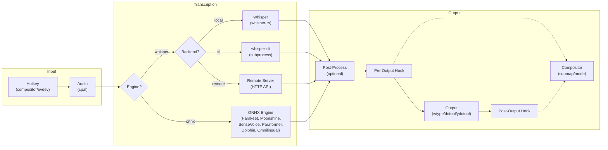

# Voxtype (Fork sk7n4k3d)

> Fork personnel avec support serveur Whisper distant + fix KDE Wayland AZERTY

[](https://voxtype.io)

**Upstream : [voxtype.io](https://voxtype.io)** | **Fork : [github.com/sk7n4k3d/voxtype](https://github.com/sk7n4k3d/voxtype)**

---

## Modifications de ce fork

### Mode Remote (serveur Whisper distant)

Au lieu de faire tourner Whisper en local, ce fork envoie l'audio à un serveur [faster-whisper-server](https://github.com/fedirz/faster-whisper-server) distant via l'API OpenAI-compatible.

**Avantages :**
- **11x plus rapide** — transcription en 0.34s au lieu de 3.8s (GPU distant RTX 4060 vs GPU local Vulkan)
- **Pas de modèle local** — pas besoin de télécharger 3 Go de modèle sur chaque PC
- **Compilation légère** — `whisper-rs` est optionnel (feature flag `local-whisper`)

### Fix KDE Wayland + AZERTY

Le mode de sortie texte utilise `wl-copy` + `ydotool Shift+Insert` au lieu de `ydotool type` :
- **AZERTY correct** — plus de `q` au lieu de `a`, plus de `:` au lieu de `.`
- **Collage instantané** — pas de délai caractère par caractère
- **Unicode complet** — accents, caractères spéciaux, emojis

### Feature flag `local-whisper`

`whisper-rs` (la lib C++ de Whisper) est maintenant optionnelle :
- **Avec** : `cargo build --release` (compile whisper.cpp, nécessite les headers C++)
- **Sans** : `cargo build --release --no-default-features` (mode remote uniquement, compilation rapide)

---

## Installation rapide (mode remote)

### Prérequis
- Un serveur [faster-whisper-server](https://github.com/fedirz/faster-whisper-server) accessible sur le réseau
- Rust 1.88+ (`rustup toolchain install 1.88.0`)
- `ydotool` + `ydotoold` (pour le Shift+Insert)
- `wl-copy` (pour le presse-papier Wayland)

### Build

```bash
git clone https://github.com/sk7n4k3d/voxtype.git
cd voxtype
rustup run 1.88.0 cargo build --release --no-default-features
sudo cp target/release/voxtype /usr/local/bin/voxtype
```

### Configuration

Éditer `~/.config/voxtype/config.toml` :

```toml
[whisper]
mode = "remote"
remote_endpoint = "http://10.8.0.101:8300"
remote_model = "deepdml/faster-whisper-large-v3-turbo-ct2"
remote_timeout_secs = 30
model = "large-v3-turbo"
language = "fr"
translate = false

[output]
mode = "type"
fallback_to_clipboard = true
type_delay_ms = 0
```

### Service systemd

```bash
mkdir -p ~/.config/systemd/user/
cat << 'EOF' > ~/.config/systemd/user/voxtype.service
[Unit]
Description=Voxtype push-to-talk voice-to-text daemon (remote mode)
PartOf=graphical-session.target
After=graphical-session.target

[Service]
Type=simple
ExecStart=/usr/local/bin/voxtype daemon
Restart=on-failure
RestartSec=5
Environment=XDG_RUNTIME_DIR=%t

[Install]
WantedBy=graphical-session.target
EOF

systemctl --user daemon-reload
systemctl --user enable --now voxtype
```

### Utilisation

Appuyer sur **Scroll Lock**, parler, relâcher. Le texte transcrit est collé automatiquement à la position du curseur.

---

## Serveur Whisper (faster-whisper-server)

Docker Compose pour le serveur de transcription :

```yaml
services:
  whisper:
    image: fedirz/faster-whisper-server:latest-cuda
    container_name: whisper
    ports:
      - "8300:8000"
    volumes:
      - ./whisper-models:/root/.cache/huggingface
    environment:
      - WHISPER__MODEL=deepdml/faster-whisper-large-v3-turbo-ct2
      - WHISPER__INFERENCE_DEVICE=cuda
      - WHISPER__TTL=-1
      - NVIDIA_VISIBLE_DEVICES=all
    deploy:
      resources:
        reservations:
          devices:
            - driver: nvidia
              count: 1
              capabilities: [gpu]
    restart: unless-stopped
```

### Performances mesurées

| Métrique | Valeur |
|----------|--------|
| Modèle | faster-whisper large-v3-turbo |
| GPU | NVIDIA RTX 4060 (8 Go VRAM) |
| VRAM utilisée | ~1.8 Go |
| Latence (2s audio) | **0.34s** |
| RTF (Real-Time Factor) | **33x temps réel** |
| Langue | Français (fr) |

---

## Différences avec l'upstream

| Fonctionnalité | Upstream | Ce fork |
|----------------|----------|---------|
| Whisper local | ✅ Obligatoire | ✅ Optionnel (feature flag) |
| Whisper distant | ✅ Supporté | ✅ Optimisé (pas de model field si vide) |
| Sortie texte KDE AZERTY | ❌ Cassé (ydotool type) | ✅ wl-copy + Shift+Insert |
| Compilation sans whisper.cpp | ❌ | ✅ `--no-default-features` |

---

## Documentation upstream

Push-to-talk voice-to-text for Linux. Optimized for Wayland, works on X11 too.

Hold a hotkey (default: ScrollLock) while speaking, release to transcribe and output the text at your cursor position.

## Features

- **Works on any Linux desktop** - Uses compositor keybindings (Hyprland, Sway, River) with evdev fallback for X11 and other environments
- **Fully offline by default** - Uses whisper.cpp for local transcription, with optional remote server support
- **7 transcription engines** - Whisper, Parakeet, Moonshine, SenseVoice, Paraformer, Dolphin, and Omnilingual (see [Supported Engines](#supported-engines) below)
- **Chinese, Japanese, Korean, and 1600+ languages** - SenseVoice, Dolphin, and Omnilingual add native support for CJK and other non-Latin scripts
- **Meeting mode** - Continuous meeting transcription with chunked processing, speaker attribution, and export to Markdown, JSON, SRT, or VTT
- **Fallback chain** - Types via wtype (best CJK support), falls back to dotool (keyboard layout support), ydotool, then clipboard
- **Push-to-talk or Toggle mode** - Hold to record, or press once to start/stop
- **Audio feedback** - Optional sound cues when recording starts/stops
- **Configurable** - Choose your hotkey, model size, output mode, and more
- **Waybar integration** - Optional status indicator shows recording state in your bar

## Quick Start

```bash
# 1. Build
cargo build --release

# 2. Install typing backend (Wayland)
# Fedora:
sudo dnf install wtype
# Arch:
sudo pacman -S wtype
# Ubuntu:
sudo apt install wtype

# 3. Download whisper model
./target/release/voxtype setup --download

# 4. Add keybinding to your compositor
# See "Compositor Keybindings" section below

# 5. Run
./target/release/voxtype
```

### Compositor Keybindings

Voxtype works best with your compositor's native keybindings. Add these to your compositor config:

**Hyprland** (`~/.config/hypr/hyprland.conf`):
```
bind = SUPER, V, exec, voxtype record start
bindr = SUPER, V, exec, voxtype record stop
```

**Sway** (`~/.config/sway/config`):
```
bindsym --no-repeat $mod+v exec voxtype record start
bindsym --release $mod+v exec voxtype record stop
```

**River** (`~/.config/river/init`):
```bash
riverctl map normal Super V spawn 'voxtype record start'
riverctl map -release normal Super V spawn 'voxtype record stop'
```

Then disable the built-in hotkey in your config:
```toml
# ~/.config/voxtype/config.toml
[hotkey]
enabled = false
```

> **X11 / Built-in hotkey fallback:** If you're on X11 or prefer voxtype's built-in hotkey (ScrollLock by default), add yourself to the `input` group: `sudo usermod -aG input $USER` and log out/in. See the [User Manual](docs/USER_MANUAL.md) for details.

> **Omarchy / Multi-modifier keybindings:** If using keybindings with multiple modifiers (e.g., `SUPER+CTRL+X`), releasing keys slowly can cause typed text to trigger window manager shortcuts instead of inserting text. See [Modifier Key Interference](docs/TROUBLESHOOTING.md#modifier-key-interference-hyprlandsway) in the troubleshooting guide for the solution using output hooks and Hyprland submaps.

## Usage

1. Run `voxtype` (it runs as a foreground daemon)
2. Hold **ScrollLock** (or your configured hotkey)
3. Speak
4. Release the key
5. Text appears at your cursor (or in clipboard if typing isn't available)

Press Ctrl+C to stop the daemon.

### Toggle Mode

If you prefer to press once to start recording and again to stop (instead of holding):

```bash
# Via command line
voxtype --toggle

# Or in config.toml
[hotkey]
key = "SCROLLLOCK"
mode = "toggle"
```

### Meeting Mode

For longer recordings like meetings and interviews, meeting mode provides continuous transcription with automatic chunking, speaker attribution, and export.

```bash
# Start a meeting
voxtype meeting start --title "Weekly standup"

# Check status
voxtype meeting status

# Stop and export
voxtype meeting stop
voxtype meeting export latest --format markdown --speakers --timestamps
```

Meetings are stored locally and can be exported to Markdown, plain text, JSON, SRT, or VTT. Use `voxtype meeting list` to see past meetings, and `voxtype meeting summarize latest` to generate an AI summary via Ollama.

## Configuration

Config file location: `~/.config/voxtype/config.toml`

See [`config/default.toml`](config/default.toml) for the full annotated default configuration.

```toml
# State file for Waybar/polybar integration (enabled by default)
state_file = "auto"  # Or custom path, or "disabled" to turn off

[hotkey]
key = "SCROLLLOCK"  # Or: PAUSE, F13-F24, RIGHTALT, etc.
modifiers = []      # Optional: ["LEFTCTRL", "LEFTALT"]
# mode = "toggle"   # Uncomment for toggle mode (press to start/stop)

[audio]
device = "default"  # Or specific device from `pactl list sources short`
sample_rate = 16000
max_duration_secs = 60

# Audio feedback (sound cues when recording starts/stops)
# [audio.feedback]
# enabled = true
# theme = "default"   # "default", "subtle", "mechanical", or path to custom dir
# volume = 0.7        # 0.0 to 1.0

[whisper]
model = "base.en"   # tiny, base, small, medium, large-v3, large-v3-turbo
language = "en"     # Or "auto" for detection, or language code (es, fr, de, etc.)
translate = false   # Translate non-English speech to English
# threads = 4       # CPU threads for inference (omit for auto-detect)
# on_demand_loading = true  # Load model only when recording (saves memory)

[output]
mode = "type"       # "type", "clipboard", or "paste"
fallback_to_clipboard = true
type_delay_ms = 0   # Increase if characters are dropped
# auto_submit = true  # Send Enter after transcription (for chat apps, terminals)
# Note: "paste" mode copies to clipboard then simulates Ctrl+V
#       Useful for non-US keyboard layouts where ydotool typing fails

[output.notification]
on_recording_start = false  # Notify when PTT activates
on_recording_stop = false   # Notify when transcribing
on_transcription = true     # Show transcribed text

# Text processing (word replacements, spoken punctuation)
# [text]
# spoken_punctuation = true  # Say "period" → ".", "open paren" → "("
# replacements = { "vox type" = "voxtype", "oh marky" = "Omarchy" }
```

### Audio Feedback

Enable audio feedback to hear a sound when recording starts and stops:

```toml
[audio.feedback]
enabled = true
theme = "default"  # Built-in themes: default, subtle, mechanical
volume = 0.7       # 0.0 to 1.0
```

**Built-in themes:**
- `default` - Clear, pleasant two-tone beeps
- `subtle` - Quiet, unobtrusive clicks
- `mechanical` - Typewriter/keyboard-like sounds

**Custom themes:** Point `theme` to a directory containing `start.wav`, `stop.wav`, and `error.wav` files.

### Text Processing

Voxtype can post-process transcribed text with word replacements and spoken punctuation.

**Word replacements** fix commonly misheard words:

```toml
[text]
replacements = { "vox type" = "voxtype", "oh marky" = "Omarchy" }
```

**Spoken punctuation** (opt-in) converts spoken words to symbols - useful for developers:

```toml
[text]
spoken_punctuation = true
```

With this enabled, saying "function open paren close paren" outputs `function()`. Supports period, comma, brackets, braces, newlines, and many more. See [CONFIGURATION.md](docs/CONFIGURATION.md#text) for the full list.

### Post-Processing Command (Advanced)

For advanced cleanup, you can pipe transcriptions through an external command
like a local LLM for grammar correction, filler word removal, or text formatting:

```toml
[output.post_process]
command = "ollama run llama3.2:1b 'Clean up this dictation. Fix grammar, remove filler words:'"
timeout_ms = 30000  # 30 second timeout for LLM
```

The command receives text on stdin and outputs cleaned text on stdout. On any
failure (timeout, error), Voxtype gracefully falls back to the original transcription.

See [CONFIGURATION.md](docs/CONFIGURATION.md#outputpost_process) for more examples including scripts for LM Studio, Ollama, and llama.cpp.

## CLI Options

```
voxtype [OPTIONS] [COMMAND]

Commands:
  daemon      Run as background daemon (default)
  transcribe  Transcribe an audio file
  setup       Setup and installation utilities
  config      Show current configuration
  status      Show daemon status (for Waybar/polybar integration)
  record      Control recording from external sources (compositor keybindings, scripts)
  meeting     Meeting transcription (start, stop, export, summarize)

Setup subcommands:
  voxtype setup              Run basic dependency checks (default)
  voxtype setup --download   Download the configured Whisper model
  voxtype setup systemd      Install/manage systemd user service
  voxtype setup waybar       Generate Waybar module configuration
  voxtype setup model        Interactive model selection and download
  voxtype setup gpu          Manage GPU acceleration (switch CPU/Vulkan)
  voxtype setup onnx         Switch between Whisper and ONNX engines

Status options:
  voxtype status --format json       Output as JSON (for Waybar)
  voxtype status --follow            Continuously output on state changes
  voxtype status --extended          Include model, device, backend in JSON
  voxtype status --icon-theme THEME  Icon theme (emoji, nerd-font, material, etc.)

Record subcommands (for compositor keybindings):
  voxtype record start                     Start recording (send SIGUSR1 to daemon)
  voxtype record start --output-file PATH  Write transcription to a file
  voxtype record stop                      Stop recording and transcribe (send SIGUSR2 to daemon)
  voxtype record toggle                    Toggle recording state

Options:
  -c, --config <FILE>    Path to config file
  -v, --verbose          Increase verbosity (-v, -vv)
  -q, --quiet            Quiet mode (errors only)
  --clipboard            Force clipboard mode
  --paste                Force paste mode (clipboard + Ctrl+V)
  --model <MODEL>        Override transcription model
  --engine <ENGINE>      Override transcription engine (whisper, parakeet, moonshine, sensevoice, paraformer, dolphin, omnilingual)
  --hotkey <KEY>         Override hotkey
  --toggle               Use toggle mode (press to start/stop)
  -h, --help             Print help
  -V, --version          Print version
```

## Whisper Models

| Model | Size | English WER | Speed |
|-------|------|-------------|-------|
| tiny.en | 39 MB | ~10% | Fastest |
| base.en | 142 MB | ~8% | Fast |
| small.en | 466 MB | ~6% | Medium |
| medium.en | 1.5 GB | ~5% | Slow |
| large-v3 | 3 GB | ~4% | Slowest |
| large-v3-turbo | 1.6 GB | ~4% | Fast |

For most uses, `base.en` provides a good balance of speed and accuracy. If you have a GPU, `large-v3-turbo` offers excellent accuracy with fast inference.

### Multilingual Support

The `.en` models are English-only but faster and more accurate for English. For other languages, use `large-v3` which supports 99 languages.

**Use Case 1: Transcribe in the spoken language** (speak French, output French)
```toml
[whisper]
model = "large-v3"
language = "auto"     # Auto-detect and transcribe in that language
translate = false
```

**Use Case 2: Translate to English** (speak French, output English)
```toml
[whisper]
model = "large-v3"
language = "auto"     # Auto-detect the spoken language
translate = true      # Translate output to English
```

**Use Case 3: Force a specific language** (always transcribe as Spanish)
```toml
[whisper]
model = "large-v3"
language = "es"       # Force Spanish transcription
translate = false
```

With GPU acceleration, `large-v3` achieves sub-second inference while supporting all languages.

## Supported Engines

Voxtype ships separate binaries for Whisper and ONNX engines. Use `voxtype setup onnx --enable` to switch to the ONNX binary, or `--disable` to switch back.

| Engine | Languages | Architecture | Best For |
|--------|-----------|-------------|----------|
| **Whisper** (default) | 99 languages | Encoder-decoder (whisper.cpp) | General use, multilingual |
| **Parakeet** | English | FastConformer TDT (ONNX) | Fast English transcription |
| **Moonshine** | English | Encoder-decoder (ONNX) | Edge devices, low memory |
| **SenseVoice** | zh, en, ja, ko, yue | CTC encoder (ONNX) | Chinese, Japanese, Korean |
| **Paraformer** | zh+en, zh+yue+en | Non-autoregressive (ONNX) | Chinese-English bilingual |
| **Dolphin** | 40 languages + 22 Chinese dialects | CTC E-Branchformer (ONNX) | Eastern languages (no English) |
| **Omnilingual** | 1600+ languages | wav2vec2 CTC (ONNX) | Low-resource and rare languages |

To set the engine in your config:

```toml
engine = "sensevoice"  # or: whisper, parakeet, moonshine, paraformer, dolphin, omnilingual
```

Or override on the command line:

```bash
voxtype --engine sensevoice
```

## GPU Acceleration

Voxtype supports optional GPU acceleration for significantly faster inference. With GPU acceleration, even the `large-v3` model can achieve sub-second inference times.

### Vulkan (AMD, NVIDIA, Intel)

Packages include a Vulkan binary. To enable GPU acceleration:

```bash
# Install Vulkan runtime (if not already installed)
# Arch:
sudo pacman -S vulkan-icd-loader

# Ubuntu/Debian:
sudo apt install libvulkan1

# Fedora:
sudo dnf install vulkan-loader

# Enable GPU acceleration
sudo voxtype setup gpu --enable

# Check status
voxtype setup gpu
```

To switch back to CPU: `sudo voxtype setup gpu --disable`

### Building from Source (CUDA, Metal, ROCm)

For other GPU backends, build from source with the appropriate feature flag:

**CUDA (NVIDIA)**
```bash
# Install CUDA toolkit first, then:
cargo build --release --features gpu-cuda
```

**Metal (macOS/Apple Silicon)**
```bash
cargo build --release --features gpu-metal
```

**HIP/ROCm (AMD alternative)**
```bash
cargo build --release --features gpu-hipblas
```

### Performance Comparison

Results vary by hardware. Example on AMD RX 6800:

| Model | CPU | Vulkan GPU |
|-------|-----|------------|
| base.en | ~7x realtime | ~35x realtime |
| large-v3 | ~1x realtime | ~5x realtime |

## Requirements

### System Requirements

- **Linux** with glibc 2.38+ (Ubuntu 24.04+, Fedora 39+, Arch, Debian Trixie+)
- **Wayland or X11** desktop (GNOME, KDE, Sway, Hyprland, River, i3, etc.)

### Runtime Dependencies

- **PipeWire** or **PulseAudio** (for audio capture)
- **wtype** (for typing output on Wayland) - *recommended, best CJK/Unicode support*
- **dotool** - *for non-US keyboard layouts (German, French, etc.) - supports XKB layouts*
- **ydotool** + daemon - *for X11 or as Wayland fallback*
- **wl-clipboard** (for clipboard fallback on Wayland)

### Permissions

- **Wayland compositors:** No special permissions needed when using compositor keybindings
- **Built-in hotkey / X11:** User must be in the `input` group (for evdev access)

### Installing Dependencies

**Fedora:**
```bash
sudo dnf install wtype wl-clipboard
```

**Ubuntu/Debian:**
```bash
sudo apt install wtype wl-clipboard
```

**Arch:**
```bash
sudo pacman -S wtype wl-clipboard
```

## Building from Source

```bash
# Install Rust if needed
curl --proto '=https' --tlsv1.2 -sSf https://sh.rustup.rs | sh

# Install build dependencies
# Fedora:
sudo dnf install alsa-lib-devel

# Ubuntu:
sudo apt install libasound2-dev

# Build
cargo build --release

# Binary is at: target/release/voxtype
```

## Waybar Integration

Add to your Waybar config:

```json
"custom/voxtype": {
    "exec": "voxtype status --follow --format json",
    "return-type": "json",
    "format": "{}",
    "tooltip": true
}
```

The state file is enabled by default (`state_file = "auto"`). If you've disabled it, re-enable it:

```toml
state_file = "auto"
```

### Extended Status Info

Use `--extended` to include model, device, and backend in the JSON output:

```bash
voxtype status --format json --extended
```

Output:
```json
{
  "text": "🎙️",
  "class": "idle",
  "tooltip": "Voxtype ready\nModel: base.en\nDevice: default\nBackend: CPU (AVX-512)",
  "model": "base.en",
  "device": "default",
  "backend": "CPU (AVX-512)"
}
```

Waybar config with model display:
```json
"custom/voxtype": {
    "exec": "voxtype status --follow --format json --extended",
    "return-type": "json",
    "format": "{} [{}]",
    "format-alt": "{model}",
    "tooltip": true
}
```

## Troubleshooting

### "Cannot open input device" error

This only affects the built-in evdev hotkey. You have two options:

**Option 1: Use compositor keybindings (recommended)**
Configure your compositor to call `voxtype record start/stop` and disable the built-in hotkey. See "Compositor Keybindings" above.

**Option 2: Add yourself to the input group**
```bash
sudo usermod -aG input $USER
# Log out and back in
```

### Text not appearing / typing not working

Voxtype uses wtype (preferred), dotool, or ydotool for typing output:

```bash
# Check available typing backends
which wtype dotool ydotool

# For non-US keyboard layouts, install dotool and configure:
# In ~/.config/voxtype/config.toml:
# [output]
# dotool_xkb_layout = "de"  # Your layout (de, fr, es, etc.)

# If using ydotool fallback (X11/TTY), start the daemon:
systemctl --user start ydotool
systemctl --user enable ydotool  # Start on login
```

**KDE Plasma / GNOME users:** wtype does not work on these desktops. Voxtype automatically falls back to dotool (recommended for non-US layouts) or ydotool. See [Troubleshooting](docs/TROUBLESHOOTING.md#wtype-not-working-on-kde-plasma-or-gnome-wayland) for setup instructions.

### No audio captured

Check your default audio input:

```bash
# List audio sources
pactl list sources short

# Test recording
arecord -d 3 -f S16_LE -r 16000 test.wav
aplay test.wav
```

### Text appears slowly

If characters are being dropped, increase the delay:

```toml
[output]
type_delay_ms = 10
```

## Architecture



**Multiple transcription engines.** Voxtype supports 7 transcription engines across two runtime backends:
- **Whisper** (default): OpenAI's Whisper model via whisper.cpp. Supports local in-process, CLI subprocess, and remote HTTP backends. 99 languages.
- **ONNX engines** (via ONNX Runtime): Parakeet (English), Moonshine (English), SenseVoice (zh/en/ja/ko/yue), Paraformer (zh+en bilingual), Dolphin (40 languages + Chinese dialects, no English), Omnilingual (1600+ languages). Switch engines with `voxtype setup onnx`.

**Why compositor keybindings?** Wayland compositors like Hyprland, Sway, and River support key-release events, enabling push-to-talk without special permissions. Voxtype's `record start/stop` commands integrate directly with your compositor's keybinding system.

**Fallback: evdev hotkey.** For X11 or compositors without key-release support, voxtype includes a built-in hotkey using evdev (the Linux input subsystem). This requires the user to be in the `input` group.

**Why wtype + dotool + ydotool?** On Wayland, wtype uses the virtual-keyboard protocol for text input, with excellent Unicode/CJK support and no daemon required. When wtype fails (KDE/GNOME), dotool provides keyboard layout support via XKB for non-US layouts. As a final fallback, ydotool uses uinput for text injection on X11/TTY. This combination ensures Voxtype works on any Linux desktop with proper keyboard layout support.

**Post-processing.** Transcriptions can optionally be piped through an external command before output. Use this to integrate local LLMs (Ollama, llama.cpp) for grammar correction, text expansion, or domain-specific vocabulary. Any command that reads stdin and writes stdout works.

## Feedback

We want to hear from you! Voxtype is a young project and your feedback helps make it better.

- **Something not working?** If Voxtype doesn't install cleanly, doesn't work on your system, or is buggy in any way, please [open an issue](https://github.com/peteonrails/voxtype/issues). I actively monitor and respond to issues.
- **Like Voxtype?** I don't accept donations, but if you find it useful:
  - A [GitHub star](https://github.com/peteonrails/voxtype) helps others discover the project
  - Arch users: a vote on the [AUR package](https://aur.archlinux.org/packages/voxtype) helps keep it maintained

## Contributors

- [Peter Jackson](https://github.com/peteonrails) - Creator and maintainer
- [jvantillo](https://github.com/jvantillo) - GPU acceleration patch, whisper-rs 0.15.1 compatibility
- [materemias](https://github.com/materemias) - Paste output mode, on-demand model loading, single-instance safeguard, PKGBUILD fix
- [Dan Heuckeroth](https://github.com/danheuck) - NixOS Home Manager module design
- [Kevin Miller](https://github.com/digunix) - NixOS module enhancements, ROCm support
- [reisset](https://github.com/reisset) - Testing and feedback on post-processing feature
- [Goodroot](https://github.com/goodroot) - Testing, feedback, and documentation updates
- [robzolkos](https://github.com/robzolkos) - Auto-submit feature for AI agent workflows
- [konnsim](https://github.com/konnsim) - Modifier key interference bug report
- [IgorWarzocha](https://github.com/IgorWarzocha) - Hyprland submap solution for modifier key fix
- [Zubair](https://github.com/mzubair481) - dotool output driver with keyboard layout support
- [ayoahha](https://github.com/ayoahha) - CLI backend for whisper-cli subprocess transcription
- [Loki Coyote](https://github.com/lokkju) - eitype output driver for KDE/GNOME support, media keys and numeric keycode hotkey support
- [Umesh](https://github.com/radiorambo) - Documentation website

## License

MIT
